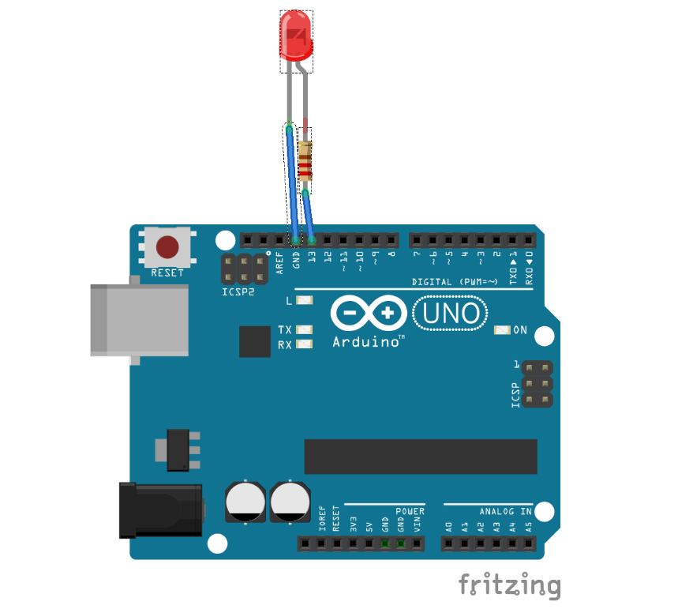

# LED Blink

## Buildin LED

**Sketch**
```C
 void setup() { // put your setup code here, to run once:
   // Set LED pin into output mode
   pinMode(LED_BUILTIN, OUTPUT);
 }

 void loop() { // put your main code here, to run repeatedly:
   digitalWrite(LED_BUILTIN, HIGH);   // Turn the LED on
   delay(1000);                       // wait one second
   digitalWrite(LED_BUILTIN, LOW);    // Turn the LED on
   delay(1000);                       // wait one second
 }
```

## Basic Led Example

**Sketch**
```C
// Define the pin connected to the LED
const int ledPin = 13;

void setup() {
  // Set the LED pin into output mode
  pinMode(ledPin, OUTPUT);
}

void loop() {
  // Turn the LED on
  digitalWrite(ledPin, HIGH);
  delay(1000); // Wait for 1 second (1000 milliseconds)

  // Turn the LED off
  digitalWrite(ledPin, LOW);
  delay(1000); // Wait for 1 second (1000 milliseconds)
}
```

**Circuit**


