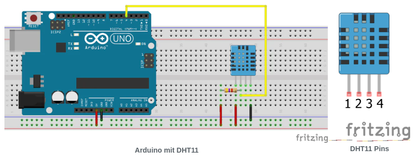
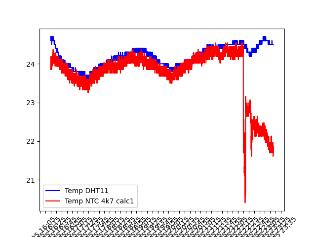

# Voltage

## Example Sketch

```C
#include "DHT.h"

#define DHTPIN 2          
#define DHTTYPE DHT11

DHT dht(DHTPIN, DHTTYPE);

void setup() {
  Serial.begin(9600);
  dht.begin();
}

void loop() {

    // Wait a few seconds between measurements.
    delay(2000);
                                    
    hum_dht11 = dht.readHumidity();
    temp_dht11 = dht.readTemperature();
    
    Serial.print("Temp:");
    Serial.println(hum_dht11);
    Serial.print("Temp:");
    Serial.println(temp_dht11);

}

```

**Components**
- DHT11

**Circuit**



**Results**


