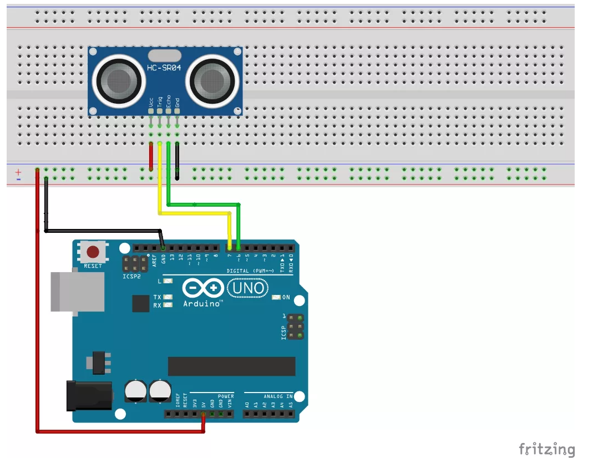

# Ultraschall-Sensor

## Example Sketch

```C

#define PIN_TRIGGER 12
#define PIN_ECHO    13

const int SENSOR_MAX_RANGE = 300; // in cm
unsigned long duration;
unsigned int distance;

void setup(){
  Serial.begin(9600);
  pinMode(PIN_TRIGGER, OUTPUT);
  pinMode(PIN_ECHO, INPUT);
}

void loop(){
  digitalWrite(PIN_TRIGGER, LOW);
  delayMicroseconds(2);

  digitalWrite(PIN_TRIGGER, HIGH);
  delayMicroseconds(10);

  duration = pulseIn(PIN_ECHO, HIGH);
  distance = duration/58;

  if (distance > SENSOR_MAX_RANGE || distance <= 0){
    Serial.println("Out of sensor range!");
  } else {
    Serial.println("Distance to object: " + String(distance) + " cm");
  }

  delay(1000);
}

```

**Components**
- HC-SR04

Characteristics:
- Spannungsversorgung : 5V (±10%)
- TTL Pegel : L < 1,0V
- messbare Distanz : ~ 2cm bis 300cm
- Messintervall : 0,3cm
- Messungen pro Sekunde : maximal 50
- Strombedarf : ca. 2mA pro Messung


Connections:
- Vcc  : Spannungsversorgung 5V
- Trig : Triggereingang, TTL-Pegel
- Echo : Ausgang Messergebnis, TTL-Pegel
- Gnd  : 


**Circuit**



**Calculation**

Speed of Sound:

$U = 331,3 + (0.5955 * T)$
Actually, there is not a linear correlation between temperature and speed of sound.
Well, Unit is meter per second.

Formula for the distance:

$$ D = 0,5 * (U * TD) $$


