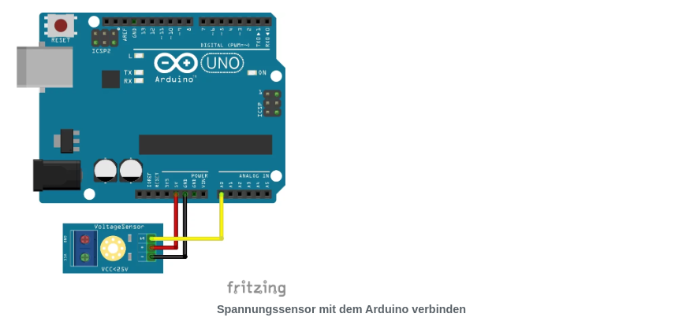
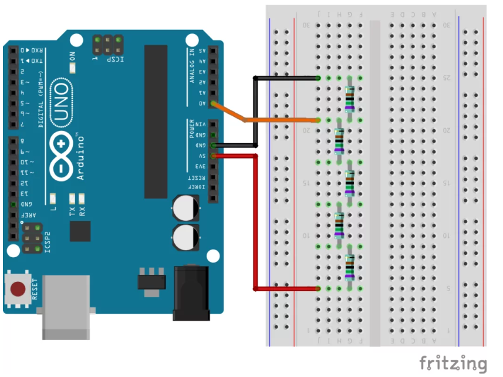

# Voltage

## Example Sketch

```C

#define SENSOR_PIN A0

void setup(){
   Serial.begin(9600);
   pinMode(SENSOR_PIN, INPUT); //set A0 to input
}

void loop(){
  float vcalc = analogRead(SENSOR_PIN) * (25.0f / 1024.0f);
  // vaclc provides values between 0 and 1023
  
  Serial.print("Eingangsspannung: ");
  Serial.print(vcalc, 2);
  Serial.println("V");

  delay(500);
}

```

**Components**
- Voltage Sensor

**Circuit**



**Calculation**

$ U=R*I $

Total resistance of an circuit:

$ R = R1 + R2 $

$ I = I1 = I2 $

$ U = (R1 + R2) * I $
$ I = U2 / R2 $

$ U = (R1 + R2) * U2 / R2 $

$ U = (U2 * (R1 + R2)) / R2 $


